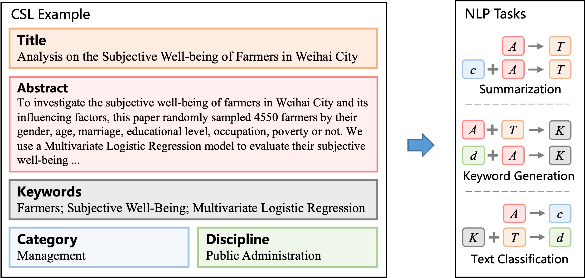

# Chinese Scientific Literature Dataset

**COLING 2022**

**CSL: A Large-scale Chinese Scientific Literature Dataset**  
*Yudong Li, Yuqing Zhang, Zhe Zhao, Linlin Shen, Weijie Liu, Weiquan Mao and Hui Zhang*

[Paper](https://arxiv.org/abs/2209.05034) | [BibTex](#bibtex)

**tl; dr** In this work, we present CSL, a large-scale **C**hinese **S**cientific **L**iterature dataset,
which contains the titles, abstracts, keywords and academic fields of 396,209 papers. 
To our knowledge, CSL is the first scientific document dataset in Chinese.
The CSL can serve as a Chinese corpus.
Also, this semi-structured data is a natural annotation that can constitute many supervised NLP tasks
(e.g., summarization, keyword generation and text classification).




## Dataset

We obtain the paper's meta-information from the 
[National Engineering Research Center for Science and Technology Resources Sharing Service (NSTR)](https://nstr.escience.net.cn) dated from 2010 to 2020.
Then, we filter data by the Catalogue of Chinese Core Journals.
According to the Catalogue and collected data, we divide academic fields into 13 first-level categories (e.g., Engineering, Science) and 67 second-level disciplines (e.g., Mechanics, Mathematics).
In total, we collect 396,209 instances for the CSL dataset, represented as tuples <T, A, K, c, d>, where *T* is the title, *A* is the abstract, *K* is a list of keywords, *c* is the category label and *d* is the discipline label.
The paper distribution over categories and the examples of disciplines are shown in below:


|  Category       |          \#d | len(T) | len(A) | num(K) | \#Samples | Discipline Examples                                   |
|-----------------|-------------:|-------:|-------:|-------:|----------:|---------------------------------------|
|  Engineering    |           27 |   19.1 |  210.9 |    4.4 |   177,600 |  Mechanics,Architecture,Electrical Science   |
|  Science        |            9 |   20.7 |  254.4 |    4.3 |    35,766 |  Mathematics,Physics,Astronomy,Geography    |
|  Agriculture    |            7 |   17.1 |  177.1 |    7.1 |    39,560 |  Crop Science,Horticulture,Forestry          |
|  Medicine       |            5 |   20.7 |  269.5 |    4.7 |    36,783 |  Clinical Medicine,Dental Medicine,Pharmacy  |
|  Management     |            4 |   18.7 |  157.7 |    6.2 |    23,630 |  Business Management,Public Administration    |
|  Jurisprudence  |            4 |   18.9 |  174.4 |    6.1 |    21,554 |  Legal Science,Political Science,Sociology   |
|  Pedagogy       |            3 |   17.7 |  179.4 |    4.3 |    16,720 |  Pedagogy,Psychology,Physical Education      |
|  Economics      |            2 |   19.5 |  177.2 |    4.5 |    11,558 |  Theoretical Economics,Applied Economics      |
|  Literature     |            2 |   18.8 |  158.2 |    8.3 |    10,501 |  Chinese Literature,Journalism                |
|  Art            |            1 |   17.8 |  170.8 |    5.4 |     5,201 |  Art                                           |
|  History        |            1 |   17.6 |  181.0 |    6.0 |     6,270 |  History                                       |
|  Strategics     |            1 |   17.5 |  169.3 |    4.0 |     3,555 |  Military Science                              |
|  Philosophy     |            1 |   18.0 |  176.5 |    8.0 |     7,511 |  Philosophy                                    |
|  All            |           67 |        |        |        |   396,209 |                                                |

## Evaluation Tasks

We build a benchmark to facilitate the development of Chinese scientific literature NLP.
It contains diverse tasks, ranging from classification to text generation, representing many practical scenarios.
We randomly select 100k samples and split the datasets into the training set, validation set and test set according to the ratio, 0.8 : 0.1 : 0.1.
This split is shared across different tasks, which allows multitask training and evaluation.
Datasets are presented in text2text format.


#### 1.Text Summarization (Title Prediction)

Predict the paper title from the abstract.

Data examples:
```
{ 
  "prompt": "to title",
  "text_a": "多个相邻场景同时进行干涉参数外定标的过程称为联合定标,联合定标能够 \
            保证相邻场景的高程衔接性,能够实现无控制点场景的干涉定标.该文提出了 \
            一种适用于机载InSAR系统的联合定标算法...",
  "text_b": "基于加权最优化模型的机载InSAR联合定标算法"
}
```

#### 2.Keyword Generation

Predict a list of keywords from a given paper title and abstract.

Data examples:
```
{ 
  "prompt": "to keywords",
  "text_a": "通过对72个圆心角为120°的双跨偏心支承弯箱梁桥模型的计算分析,以梁 \
            格系法为基础编制的3D-BSA软件系统为结构计算工具,用统计分析的方法建 \
            立双跨偏心支承弯箱梁桥结构反应在使用极限状态及承载能力极限状态下与 \
            桥梁跨长... 偏心支承对120°圆心角双跨弯箱梁桥的影响",
  "text_b": "曲线桥_箱形梁_偏心支承_设计_经验公式"
}
```

#### 3.Category Classification

Predict the category with the paper title (13 classes).

Data examples:
```
{ 
  "prompt": "to category",
  "text_a": "基于模糊C均值聚类的流动单元划分方法——以克拉玛依油田五3中区克下组为例",
  "text_b": "工学"
},
{ 
  "prompt": "to category",
  "text_a": "正畸牵引联合牙槽外科矫治上颌尖牙埋伏阻生的临床观察",
  "text_b": "医学"
}
```

#### 4.Discipline Classification

Predict the discipline with the paper abstract (67 classes).

Data examples:
```
{ 
  "prompt": "to discipline",
  "text_a": "某铁矿选矿厂所产铁精矿含硫超过0.3%,而现场为了今后发展的需要,要 \
             求将含硫量降到0.1%以下.为此,针对该铁精矿中硫化物主要以磁黄铁矿 \
             形式存在、硫化物多与铁矿物连生且氧化程度较高的特点...",
  "text_b": "矿业工程"
},
{ 
  "prompt": "to discipline",
  "text_a": "为了校正广角镜头的桶形畸变,提出一种新的桶形畸变数字校正方法.它 \
             使用点阵样板校正的方法,根据畸变图和理想图中圆点的位置关系,得出 \
             畸变图像素在X轴和Y轴方向上的偏移量曲面...",
  "text_b": "计算机科学与技术"
}
```

## Code and Baselines

Experiments are conducted on three popular text2text models ([T5](https://github.com/dbiir/UER-py/wiki/Modelzoo#chinese-t5-pre-trained-weights),
[BART](https://github.com/dbiir/UER-py/wiki/Modelzoo#bart-pre-trained-weights) 
and [Pegasus](https://github.com/dbiir/UER-py/wiki/Modelzoo#pegasus-pre-trained-weights))
based on UER-py framework.
1. Clone the project, download the pre-trained models to `UER-py/models/`

```
git clone https://github.com/ydli-ai/CSL.git
git clone https://github.com/dbiir/UER-py.git

cp CSL/run_text2text_csl.py UER-py/finetune/
```

2. Prepare data, fine-tune on single task (summarization as example)
```
cp -r CSL/benchmark/ UER-py/datasets/

cd UER-py

python3 finetune/run_text2text_csl.py --pretrained_model_path models/t5_base.bin \
                                  --vocab_path models/google_zh_with_sentinel_vocab.txt \
                                  --output_model_path models/finetuned_model.bin \
                                  --config_path models/t5/base_config.json \
                                  --train_path datasets/benchmark/ts/train.tsv \
                                  --dev_path datasets/benchmark/ts/dev.tsv \
                                  --test_path datasets/benchmark/ts/test.tsv \
                                  --seq_length 512 --tgt_seq_length 48 --report_steps 200 \
                                  --learning_rate 3e-4 --batch_size 24 --epochs_num 5 --metrics 1
```


## Download


|                  | Samples |                                                                            Access |
|------------------|--------:|----------------------------------------------------------------------------------:|
| CSL Benchmark    |     10k |                                                                        in project |
| CSL Sub-dataset  |     40k | [Google Drive](https://drive.google.com/file/d/1ve7ufyvf7ZtFygucgRrw-cKC2pqPlWZT) |
| CSL Full-dataset |    396k | [Google Drive](https://drive.google.com/file/d/1xEDgtqHU4qm0Sp-dKjc5KerAmWydmh3-/view?usp=sharing) |


## Shout-outs

CSL has been used by:

1. CLUE Benchmark 中文语言理解测评基准 - [CSL 关键词识别 Keyword Recognition](https://github.com/CLUEbenchmark/CLUE#csl-%E5%85%B3%E9%94%AE%E8%AF%8D%E8%AF%86%E5%88%AB--keyword-recognition-accuracy)

2. FewCLUE 小样本学习测评基准 - [CSLDCP 中文科学文献学科分类](https://github.com/CLUEbenchmark/FewCLUE#2-csldcp--%E4%B8%AD%E6%96%87%E7%A7%91%E5%AD%A6%E6%96%87%E7%8C%AE%E5%AD%A6%E7%A7%91%E5%88%86%E7%B1%BB%E6%95%B0%E6%8D%AE%E9%9B%86)

3. bert4keras - [论文标题生成](https://github.com/bojone/bert4keras/tree/master/examples#%E7%AE%80%E4%BB%8B)

## BibTeX

```
@inproceedings{li-etal-2022-csl,
    title = "{CSL}: A Large-scale {C}hinese Scientific Literature Dataset",
    author = "Li, Yudong  and
      Zhang, Yuqing  and
      Zhao, Zhe  and
      Shen, Linlin  and
      Liu, Weijie  and
      Mao, Weiquan  and
      Zhang, Hui",
    booktitle = "Proceedings of the 29th International Conference on Computational Linguistics",
    month = oct,
    year = "2022",
    address = "Gyeongju, Republic of Korea",
    publisher = "International Committee on Computational Linguistics",
    url = "https://aclanthology.org/2022.coling-1.344",
    pages = "3917--3923",
}
```

